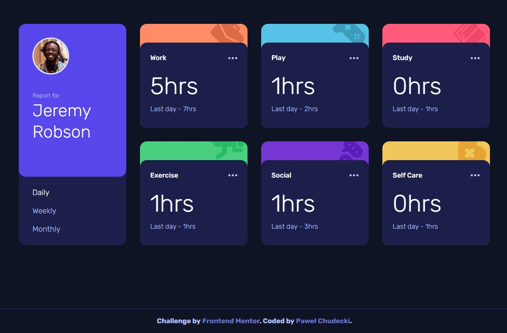

# Frontend Mentor - Time tracking dashboard solution

This is a solution to the [Time tracking dashboard challenge on Frontend Mentor](https://www.frontendmentor.io/challenges/time-tracking-dashboard-UIQ7167Jw). Frontend Mentor challenges help you improve your coding skills by building realistic projects.

## Table of contents

- [The challenge](#the-challenge)
- [Screenshot](#screenshot)
- [Links](#links)
- [Built with](#built-with)
- [Author](#author)

### The challenge

Users should be able to:

- View the optimal layout for the site depending on their device's screen size
- See hover states for all interactive elements on the page
- Switch between viewing Daily, Weekly, and Monthly stats

### Screenshot

### Links

- Solution URL: [https://www.frontendmentor.io/solutions/time-tracking-dashboard-DUZHWiaUZI](https://www.frontendmentor.io/solutions/time-tracking-dashboard-DUZHWiaUZI)
- Live Site URL: [https://soulrvr29.github.io/time-tracking-dashboard/](https://soulrvr29.github.io/time-tracking-dashboard/)

### Built with

- Semantic HTML5 markup
- CSS custom properties
- Flexbox
- CSS Grid
- Mobile-first workflow
- [React](https://reactjs.org/) - JS library
- [Tailwind](https://tailwindcss.com/) - CSS framework

## Author

- Frontend Mentor - [@SoulRvr29](https://www.frontendmentor.io/profile/SoulRvr29)
